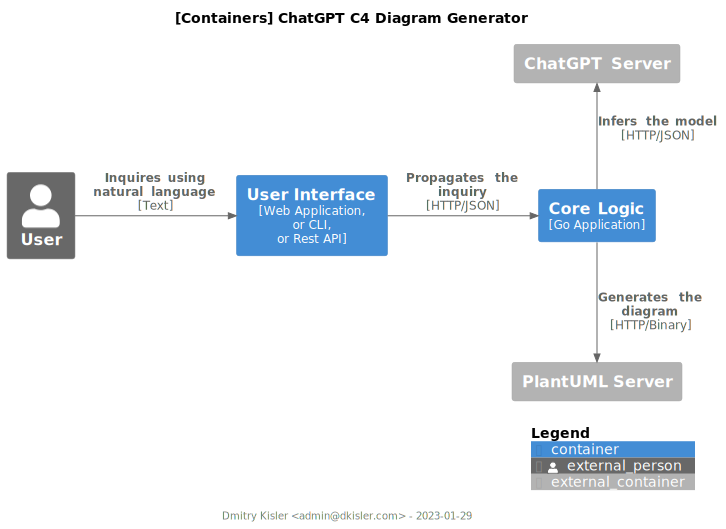

# ChatGPT C4 Diagram Generator

The tool generates C4 diagram using textual description.

## Architecture

<em>[[C4 Containers] Architecture design.](www.plantuml.com/plantuml/svg/RP9FRvj04CNlV8efKXL7Yiqbfwggd6BBSMido7-KGrjPOtOCgowxT7Peus_V1HFRKii5zkdz7lC6nbwGfQbCz4xRt3IAe1If_OSaOVmpAhIKpRxnnBcpGbP6kQkIsg1jcQ4NPVG-IU-7MIjjbukaGY_4GTgbWK1jYKTrcn-95aCGVplh_WUa9Seisq1w3nED1MC5CxB4A8xZA3eu5y8WdbHQ-0XVjJVX-15LfUrO_UoExKIVO0Zl5GeDRexX6YwNGwLkRaD2HkoTtKrVPT2sk8Du6sxnRHITnnWqkfTXReNuW3d5GNcXFJpKjT4vYdRsxhjr3EbYVdfOaHTuoEOXwfAqfy2bZWaMhj1vcp9pro7Nxcwel4GfQccnVXLhuj_4_nZVTXwSRxk-MACLcTsgRzZLcTjVZMRoq7Xj2x0e3QE1G1OD5bs_3RrAO7iqGDtq6RiQ2vI0IacWkvnZwt_SRBBao_hvgOUsNTrBWRaz49-eoYao_sCc7NFLfV_Q_TlKwHyuav-rHJws1TUFpo-xnNGsVPeCRgCnMHNulm00)</em>

## References

- [zopfi](https://github.com/google/zopfli): The library used to compress and encode the C4 Diagram definition as code
  as the string request content to generate diagram using [PlantUML](www.plantuml.com/plantuml/uml) server.
- The encoding [logic](converter.js)
