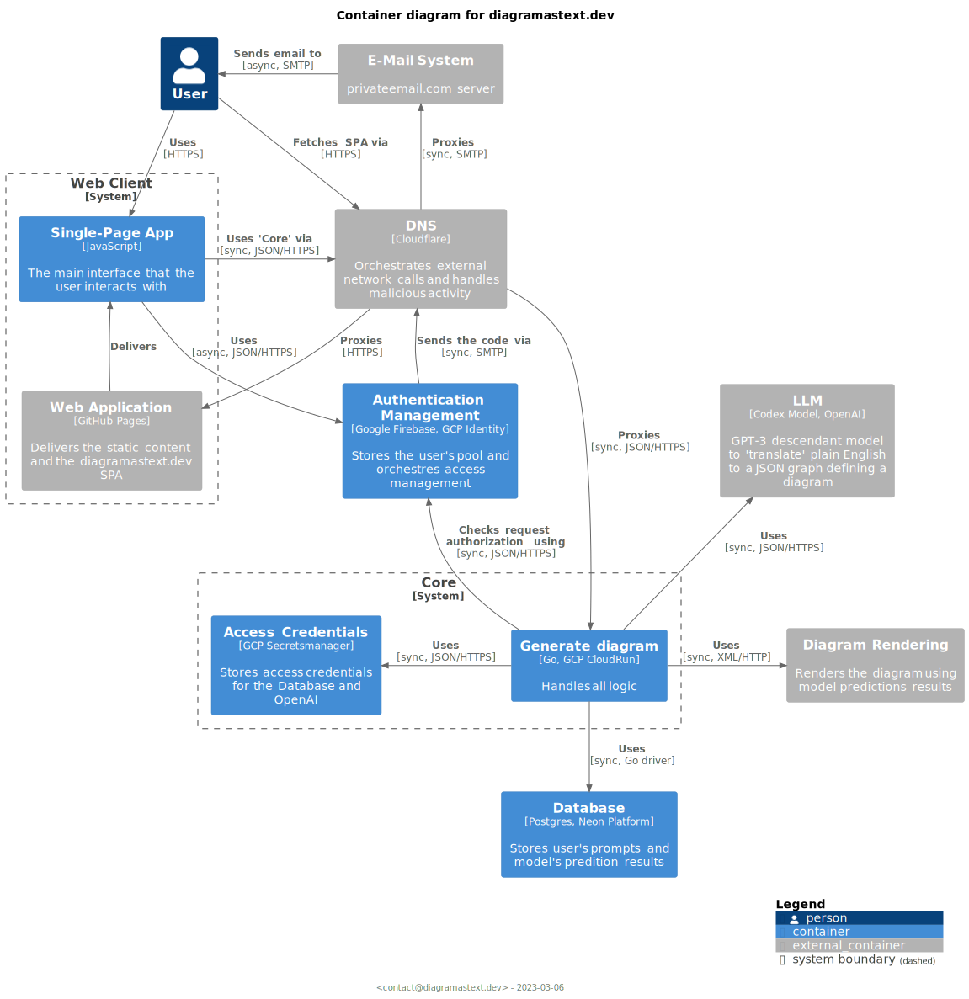

# diagramastext.dev backend logic

## Architecture

### AWS

### GCP

It was decided to migrate to GCP from AWS because of recent slow-downs of OpenAI. Its average response latency exceeds
the hard limit for the AWS API Gateway timeout's limit of 29 sec.  
