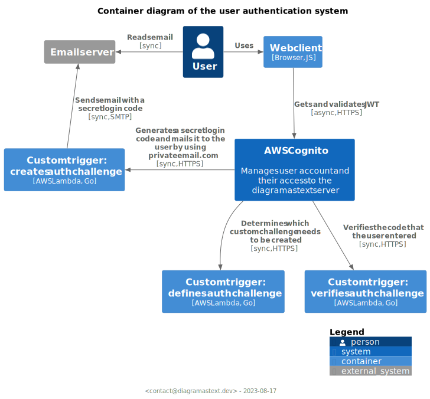

# CIAM: Customer Identity and Account Management

The directory contains the codebase to define and configure CIAM built on the basis
of [AWS Cognito](https://aws.amazon.com/cognito/).

## Features

- AuthN/Z using OAuth2.0
- Client's passwordless authentication

## Architecture

## References

- [AWS Blog](https://aws.amazon.com/blogs/mobile/implementing-passwordless-email-authentication-with-amazon-cognito/)
