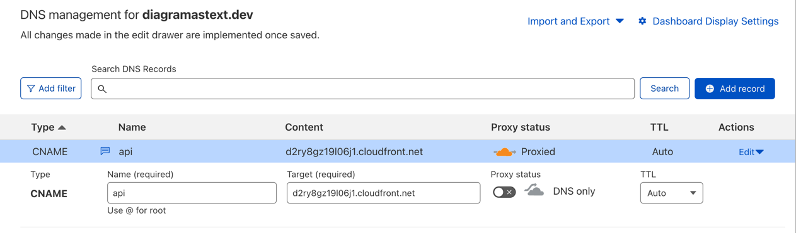

# diagramastext `core` backend logic

[](https://codecov.io/github/kislerdm/diagramastext)

The codebase orchestrates transformations of the user's inquiry.

## Local Development

### Requirements

- go 1.19
- gnuMake
- docker
- awscli
- sed

### Commands

Run to setup the local test env:

```commandline
docker run -d -p 4566:4566 -e SERVICES=secretsmanager localstack/localstack:1.4
aws --endpoint-url http://localhost:4566 --region us-east-2 secretsmanager create-secret --name "tests" > /dev/null 2>&1

aws --endpoint-url http://localhost:4566 --region us-east-2 secretsmanager put-secret-value --secret-id "tests" \
    --secret-string "{\"openai_api_key\":\"sk-xxx\",\"\"}" > /dev/null $1

export ACCESS_CREDENTIALS_ARN=$(aws --endpoint-url http://localhost:4566 --region us-east-2 secretsmanager list-secrets --filter Key="name",Values="tests" --query 'SecretList[0].ARN' | sed 's/"//g')
```

Run to perform unittests of all modules:

```commandline
make tests
```

## References

- [zopfi](https://github.com/google/zopfli): The library used to compress and encode the C4 Diagram definition as code
  as the string request content to generate diagram using [PlantUML](www.plantuml.com/plantuml/uml) server.
- The encoding [logic](rendering/plantuml/plantump-webclient-mimic/src/converter.js)

## DNS

Cloudflair is used as DNS. Follow the steps to set it up:

1. Select us-east-1 as the region
2. Go to AWS Certificate Manager
3. Request a certificate
4. Set CNAME records in Cloudflair to validate ownership
5. Configure the API GW Custom domain:
```terraform
resource "aws_api_gateway_domain_name" "this" {
  domain_name     = "api.diagramastext.dev"
  certificate_arn = "arn:aws:acm:us-east-1:xxxxxxxxxxxxx"
}

resource "aws_api_gateway_base_path_mapping" "this" {
  api_id      = aws_api_gateway_rest_api.this.id
  stage_name  = aws_api_gateway_stage.this["production"].stage_name
  domain_name = aws_api_gateway_domain_name.this.domain_name
}
output "gw_domain_name" {
  value       = aws_api_gateway_domain_name.this.cloudfront_domain_name
  description = "API GW domain name required to configure custom DNS, e.g. Cloudflaire"
}
```
6. Use output `gw_domain_name` to configure CNAME record in Cloudflaire. See the illustration below.



**Note** that the proxy status shall be set to "DNS only".

## Acknowledgements

- [William MacKay](https://github.com/foobaz) for the [go-zopfli](https://github.com/foobaz/go-zopfli) module
