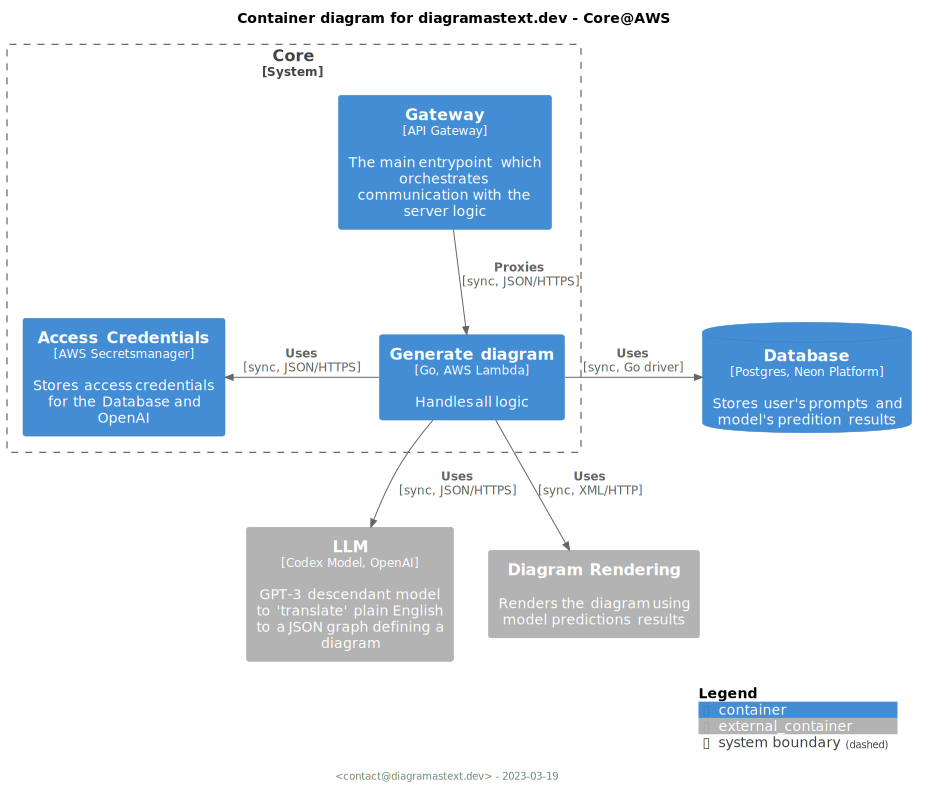

# Deployment to AWS

**Note** that it's deprecated as of 2023-03.

## Architecture



## DNS

Cloudflair is used as DNS. Follow the steps to set it up:

1. Select us-east-1 as the region
2. Go to AWS Certificate Manager
3. Request a certificate
4. Set CNAME records in Cloudflair to validate ownership
5. Configure the API GW Custom domain:
```terraform
resource "aws_api_gateway_domain_name" "this" {
  domain_name     = "api.diagramastext.dev"
  certificate_arn = "arn:aws:acm:us-east-1:xxxxxxxxxxxxx"
}

resource "aws_api_gateway_base_path_mapping" "this" {
  api_id      = aws_api_gateway_rest_api.this.id
  stage_name  = aws_api_gateway_stage.this["production"].stage_name
  domain_name = aws_api_gateway_domain_name.this.domain_name
}
output "gw_domain_name" {
  value       = aws_api_gateway_domain_name.this.cloudfront_domain_name
  description = "API GW diagram name required to configure custom DNS, e.g. Cloudflaire"
}
```
6. Use output `gw_domain_name` to configure CNAME record in Cloudflaire. See the illustration below.


**Note** that the proxy status shall be set to "DNS only".
