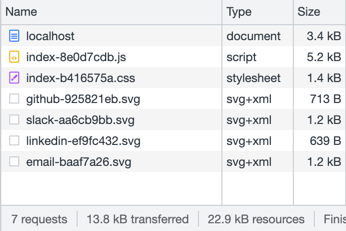

# Webclient

## Size

### Status quo

_Total size_: 28.7 kB

- Single html with embedded js and css. 
- All elements are plain (non-uglified).


#### sLOC

```commandline
-------------------------------------------------------------------------------
Language                     files          blank        comment           code
-------------------------------------------------------------------------------
HTML                             1              7              1            255
CSS                              1             39              3            219
JavaScript                       1             30              0            126
-------------------------------------------------------------------------------
SUM:                             3             76              4            600
-------------------------------------------------------------------------------
```

### Challenger



#### sLOC

```commandline
-------------------------------------------------------------------------------
Language                     files          blank        comment           code
-------------------------------------------------------------------------------
TypeScript                       8             57             33            315
CSS                              5             30              1            199
HTML                             2              5              0             41
```

### Comparison Table

| Metric                   | Status Quo | Challanger |
|:-------------------------|-----------:|-----------:|
| Transferred Total [kB]   |       11.2 |       28.7 |
| Resources Total [kB]     |       13.8 |       22.9 |
| Number of Requests Total |          3 |          7 |

**Note** 

- Both, status quo and the challenger, implement identity functionality, but:
  - The challenger includes svg resize;
  - The challenger includes compressed svg social media icons, and the placeholder diagram.
